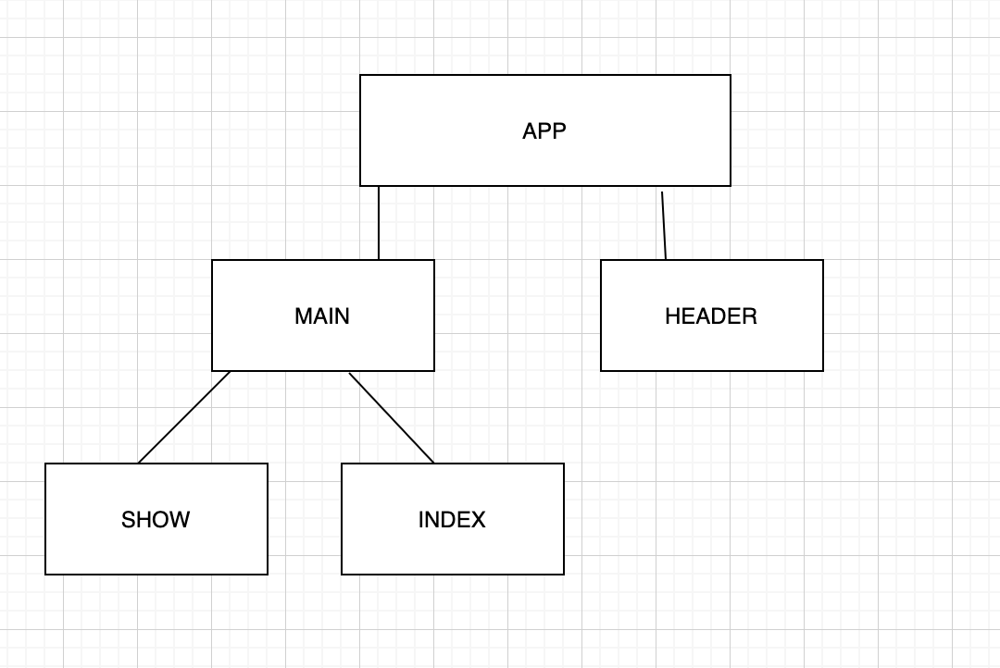

#Bookmark APP

# Bookmark'd

Bookmark'd is a Javascript application for saving your favorite links on the Internet!

## Installation

No installation is required, please see usage for the link to the Bookmark'd app.

## Usage

<a href="https://bookmark-app-backend.herokuapp.com/">Click here to use Bookmark'd</a>

## Component Tree

React Router Table 

    -> App
      -> Header
      -> Main |state: bookmark|
        -> Switch
          -> Route |path: "/"|
            -> Index |Props: bookmark, createBookmark|
          -> Route |path="/bookmark/:id|
            -> Show |Props: bookmark, updateBookmark, deleteBookmark|

## Technologies used

- Javascript

- HTML

- CSS

- React

## Backend Repository

[Bookmark'd Repository link](https://github.com/katiepestotnik/bookmark-app-backend){:target="_blank"}

Created with care by Gianelle, Katie, Lydia

